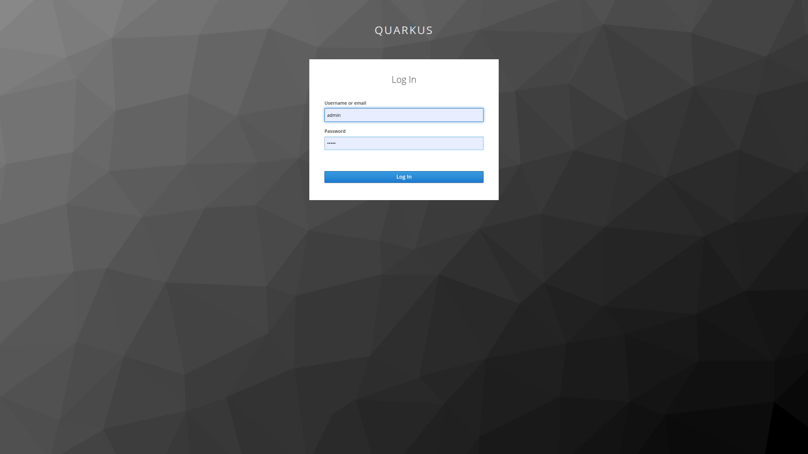
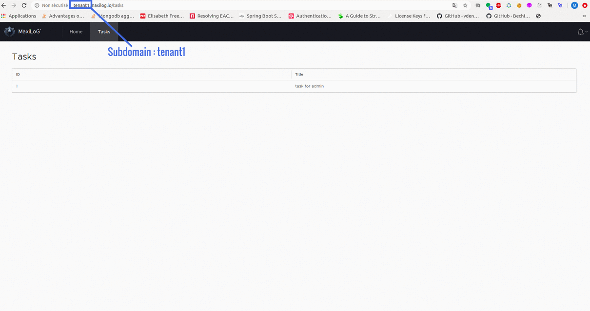

# Quarkus multi tenant

In this example, we build a very simple quarkus application:


## Requirements

To compile and run this demo you will need:
- JDK 1.8+
- GraalVM
- NodeJS

Make sure you have this ports available
- 80
- 8080
- 8180
- 5432

## Setup environment
* Adding a host name in the /etc/hosts file
```bash
sudo gedit /etc/hosts

#paste this hostnames#
127.0.0.1       tenant1.maxilog.io
127.0.0.1       tenant2.maxilog.io
127.0.0.1       tenant3.maxilog.io
```

* To start a Keycloak Server,Nginx, Postgres  you can use Docker and just run the following command:
```bash
docker-compose -f src/main/docker/docker-compose.yaml up -d
```

You should be able to access your Keycloak Server at http://localhost:8180/auth .

Log in as admin to access the Keycloak Administration Console.
Username should be `admin` and password `admin`.

For more details, see the Keycloak documentation about how to https://www.keycloak.org/docs/latest/server_admin/index.html#_create-realm[create a new realm].


### Initialized Tenant

######keycloak realms:
  - default:
    - Clients : 
      - front
      - back | back (backend)
    - Users : 
      - admin | admin
      - user | user 
  - tenant1:
    - Clients : 
      - front
      - back | back (backend)
    - Users : 
      - admin | admin
      - user | user  
  - tenant2:
    - Clients : 
      - front
      - back | back (backend)
    - Users : 
      - admin | admin
      - user | user  

######Databases:
  - default:
    - maxilog-default: 
      - maxilog-default-user | maxilog-default-password
  - tenant1:
    - maxilog-tenant1: 
      - maxilog-tenant1-user | maxilog-tenant1-password
  - tenant2:
    - maxilog-tenant2: 
      - maxilog-tenant2-user | maxilog-tenant2-password

###Get an access token
Change `REALM`, `USERNAME` and `PASSWORD` by the information of the realm you want to connect :
```bash
export access_token=$(\
    curl -X POST http://localhost:8180/auth/realms/REALM/protocol/openid-connect/token \
    --header 'Content-Type: application/x-www-form-urlencoded' \
    --data-urlencode 'username=USERNAME' \
    --data-urlencode 'password=PASSWORD' \
    --data-urlencode 'client_id=front' \
    --data-urlencode 'grant_type=password' | jq --raw-output '.access_token' \
 )
````

Example :

```bash
export access_token=$(\
    curl -X POST http://localhost:8180/auth/realms/tenant1/protocol/openid-connect/token \
    --header 'Content-Type: application/x-www-form-urlencoded' \
    --data-urlencode 'username=admin' \
    --data-urlencode 'password=admin' \
    --data-urlencode 'client_id=front' \
    --data-urlencode 'grant_type=password' | jq --raw-output '.access_token' \
 )
```

### Get your task list
If you get the token from `tenant1` realm :

```bash
curl -X GET -v http://localhost:8080/api/tasks/me \
--header  "x-tenant: tenant1" \
--header  "Authorization: Bearer $access_token"
```

###Create new Tenant
To create new tenant you have to use `default` tenant.

Let's create tenant named `tenant3`
```bash
export access_token=$(\
    curl -X POST http://localhost:8180/auth/realms/default/protocol/openid-connect/token \
    --header 'Content-Type: application/x-www-form-urlencoded' \
    --data-urlencode 'username=admin' \
    --data-urlencode 'password=admin' \
    --data-urlencode 'client_id=front' \
    --data-urlencode 'grant_type=password' | jq --raw-output '.access_token' \
 )
 
curl -X POST -v http://localhost:8080/api/tenants/tenant3 \
--header  "x-tenant: default" \
--header  "Authorization: Bearer $access_token"
```

This command will create realm `tenant3` and database `maxilog-tenant3`.

PS: In this case, you have to add hostname to `/etc/hosts` :

`127.0.0.1       tenant3.maxilog.io`


####Backend(quarkus)
> ./mvnw compile quarkus:dev

This command will leave Quarkus running in the foreground listening on port 8080.

####Frontend(angular)
```bash
cd src/main/webapp/
npm install
npm start
```
You should be able to access your angular app at `http://tenant1.maxilog.io` or `http://tenant2.maxilog.io`.


